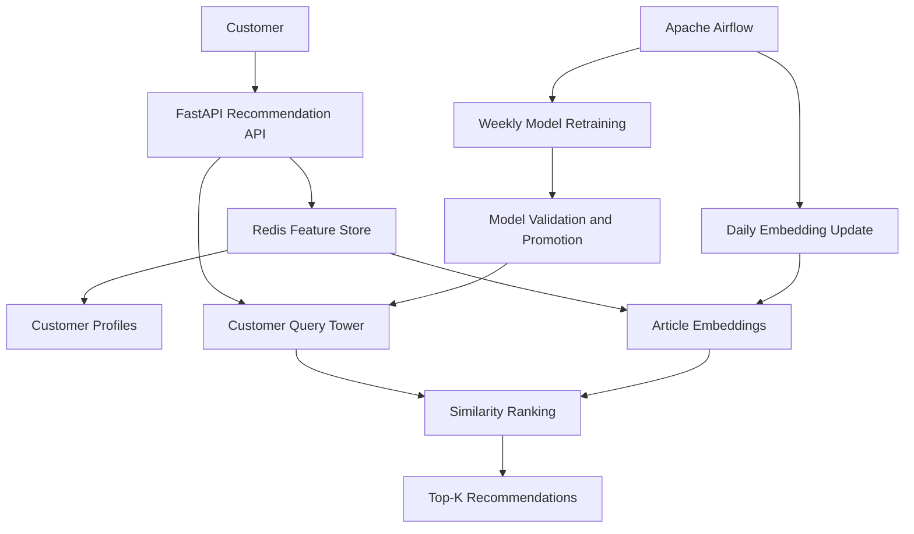

# H&M Recommendation Engine – Week 4 Architecture

```mermaid
flowchart TD
    A[Customer] --> B[FastAPI Recommendation API]
    B --> C[Redis Feature Store]
    C --> D[Customer Profiles]
    C --> E[Article Embeddings]
    B --> F[Customer Query Tower]
    F --> G[Similarity Ranking]
    E --> G
    G --> H[Top-K Recommendations]

    I[Apache Airflow] --> J[Weekly Model Retraining]
    I --> K[Daily Embedding Update]
    J --> L[Model Validation and Promotion]
    L --> F
    K --> E
```
